# How puru Works Under the Hood

This document explains the internal architecture of `puru` with diagrams. If you just want to use the library, see the [API Reference](/docs/api). If you want help choosing the right abstraction, start with [Choosing the Right Primitive](/docs/guides/choosing-primitives).

The diagrams here explain behavior and tradeoffs. They are not a promise that every internal detail is stable public API.

## Architecture Overview

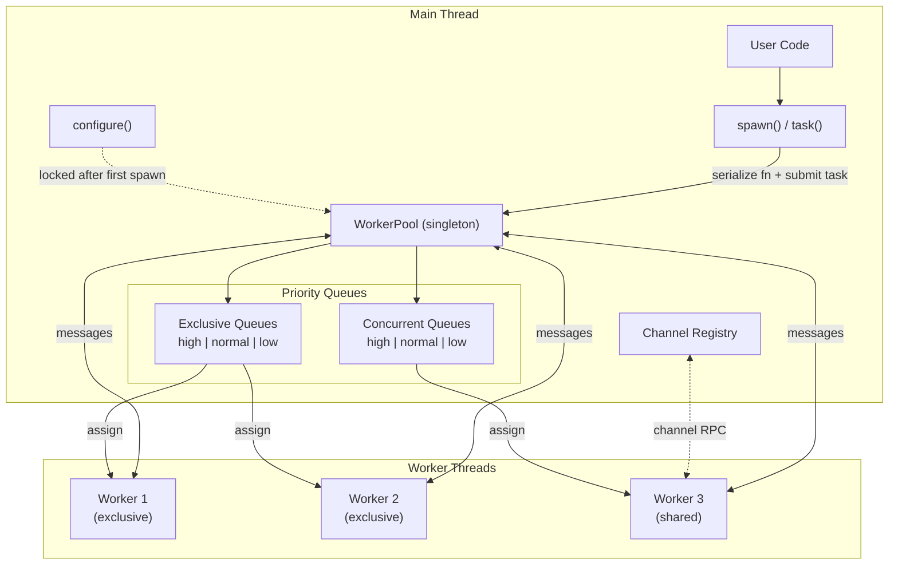

## The Two Execution Modes

puru routes every task into one of two modes based on the `concurrent` option:

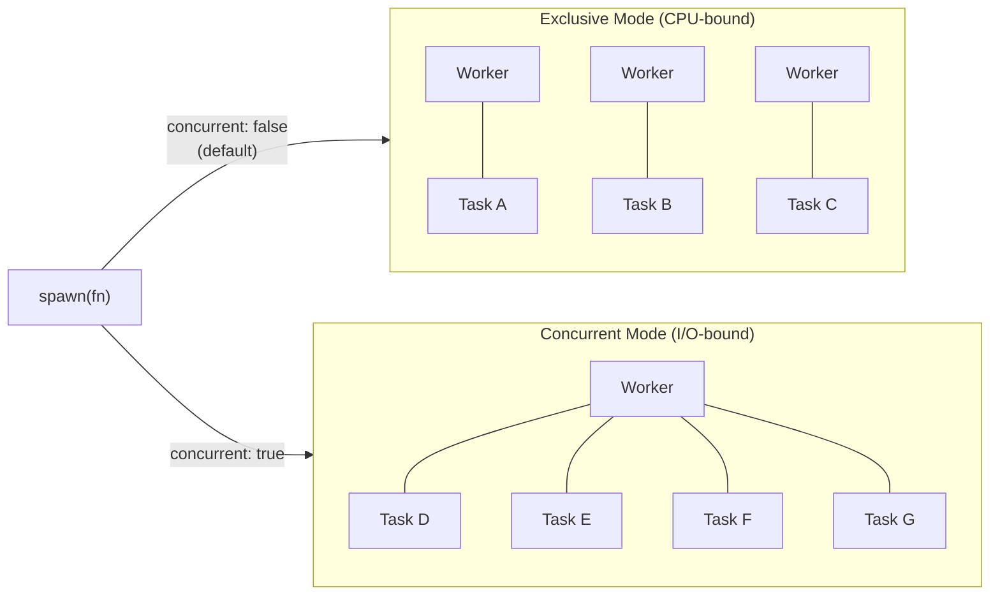

| | Exclusive (default) | Concurrent |
|---|---|---|
| **Best for** | CPU-heavy work (> 5ms) | Async / I/O work |
| **Worker usage** | 1 worker = 1 task | 1 worker = up to 64 tasks |
| **Blocking OK?** | Yes (own thread) | No (blocks other tasks) |
| **Cancellation** | Terminates the worker | Sends cancel message |

## Task Lifecycle

Every task goes through these stages from the moment you call `spawn()`:

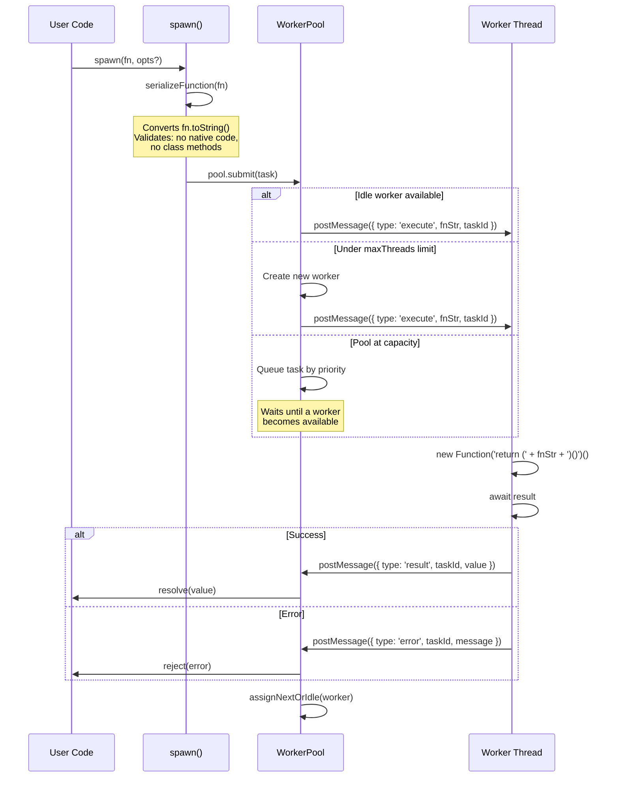

## Worker Pool Internals

The pool manages three collections of workers and routes tasks through priority queues:

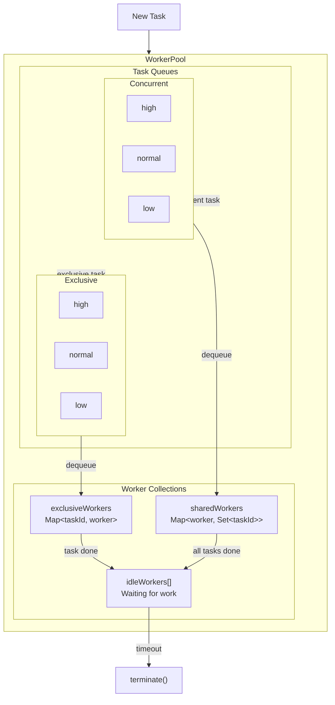

### Scheduling Algorithm

When a worker finishes a task:

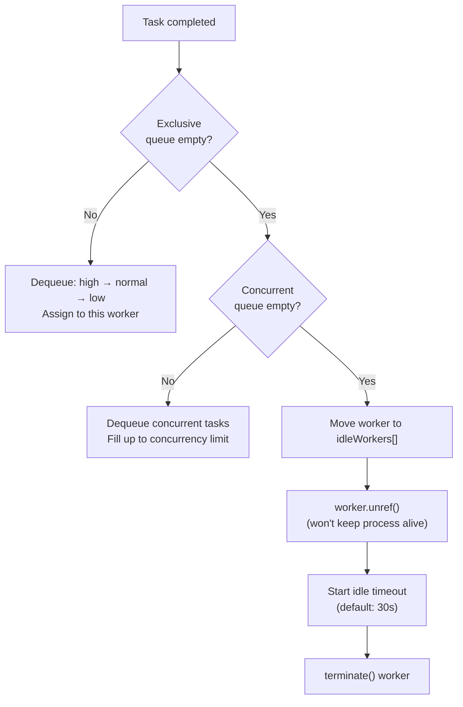

## Worker Lifecycle

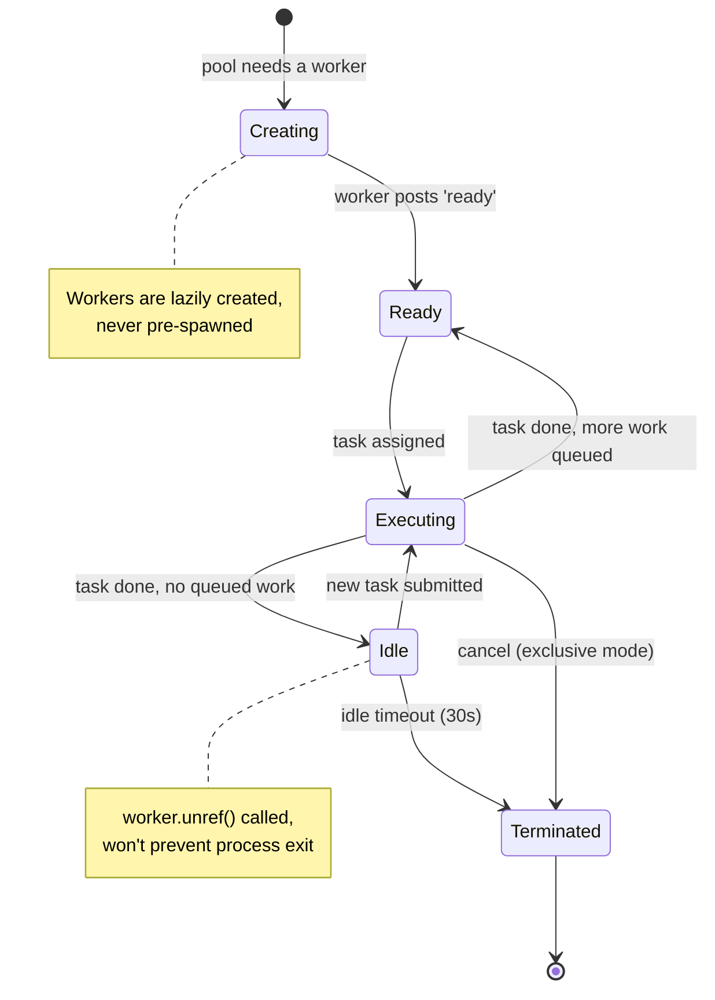

## Channel Communication (Cross-Thread RPC)

Channels enable Go-style communication between worker threads and the main thread. Since workers can't share memory, puru uses an RPC bridge:

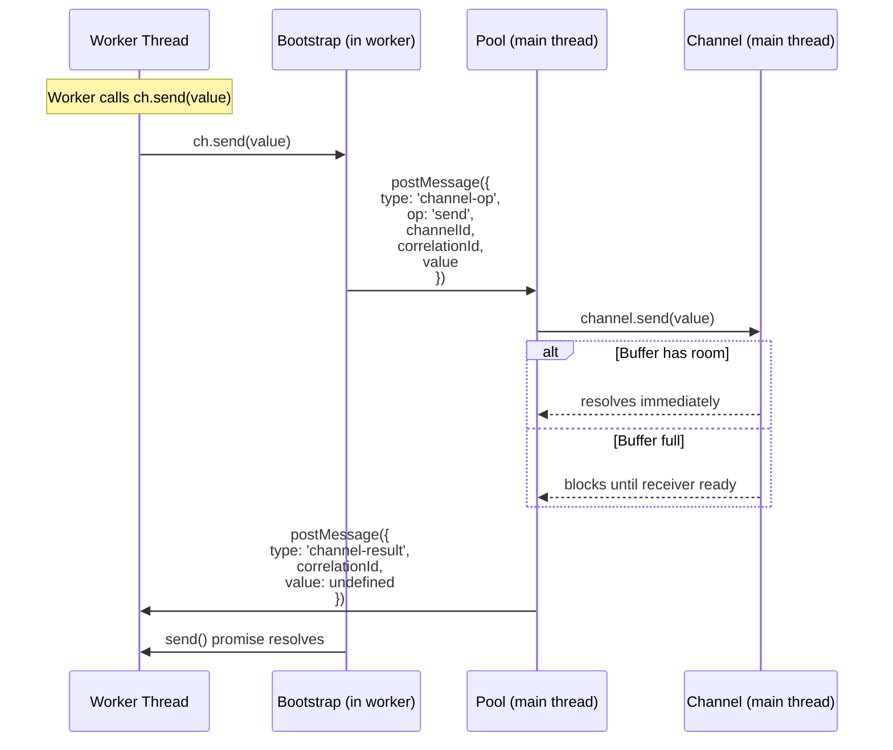

### Channel Buffer Mechanics

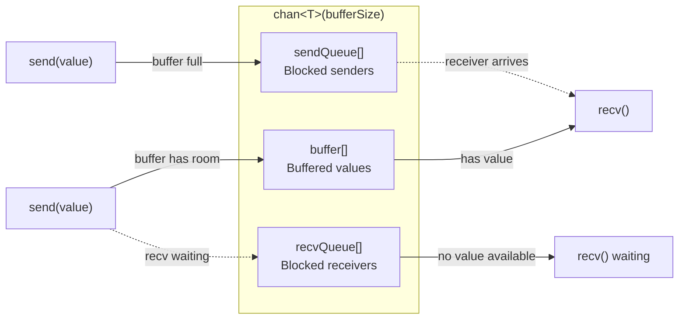

**send(value):**
1. If a receiver is waiting → deliver directly
2. If buffer has room → buffer the value
3. Otherwise → sender blocks until space opens

**recv():**
1. If buffer has a value → take it (and unblock a pending sender)
2. If a sender is waiting → take directly
3. If channel is closed → return `null`
4. Otherwise → receiver blocks until a value arrives

## Function Serialization

The core trick that makes puru ergonomic: you write inline functions, and they get serialized to strings and sent to workers.

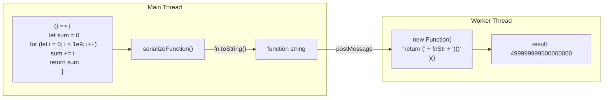

### Validation checks

`serializeFunction()` rejects:
- **Native functions** - `[native code]` in toString output
- **Class methods** - ambiguous shorthand syntax
- **Tampered toString** - guards against prototype tampering

### The Big Rule

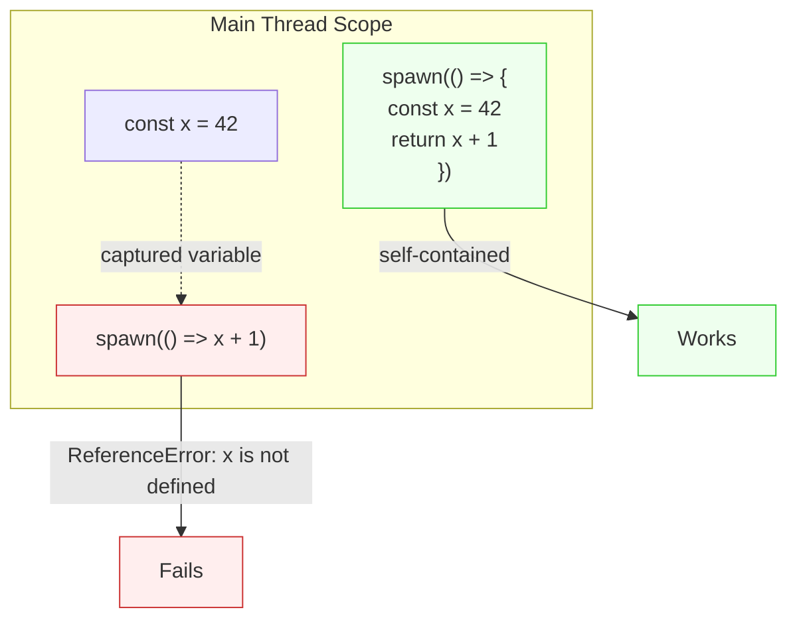

Functions are serialized as **text** — they lose all closure bindings. Everything the function needs must be defined inside it, or passed via the `channels` option.

## Runtime Adapters

puru adapts to different JavaScript runtimes using the Strategy pattern:

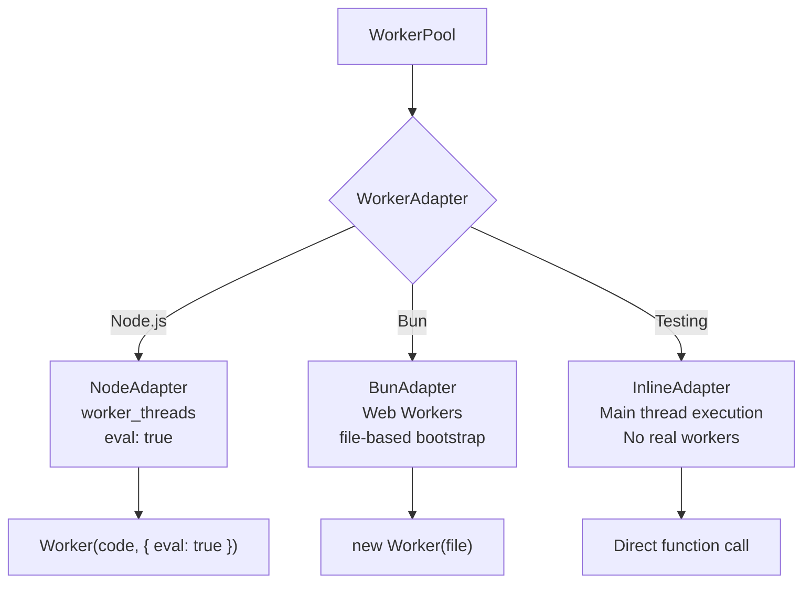

Each adapter implements `createWorker()` which returns a `ManagedWorker` with a unified interface for `postMessage`, `on('message')`, `terminate()`, `ref()`, and `unref()`.

## Key Design Decisions

| Decision | Why |
|---|---|
| **Lazy worker creation** | Don't pay for threads you don't use. Workers are created on demand, not pre-spawned. |
| **Function serialization** | No separate worker files. Write logic inline and it gets sent to the worker as a string. Trade-off: no closures. |
| **Dual-mode pool** | CPU work needs isolation (exclusive). I/O work needs throughput (concurrent/shared). One pool handles both. |
| **Channel RPC bridge** | Workers can't share channel objects. The bootstrap layer proxies channel operations back to the main thread via structured messages. |
| **Priority queues** | Critical tasks can jump ahead without complex scheduling. Simple three-tier FIFO. |
| **Idle timeout + unref** | Workers clean themselves up. Process exits naturally when no work remains. |
| **Adapter pattern** | Node.js and Bun have different worker APIs. Adapters isolate this behind a common interface. |
| **Config lock** | Changing pool settings mid-flight would cause inconsistencies. Config is frozen after the first `spawn()`. |
